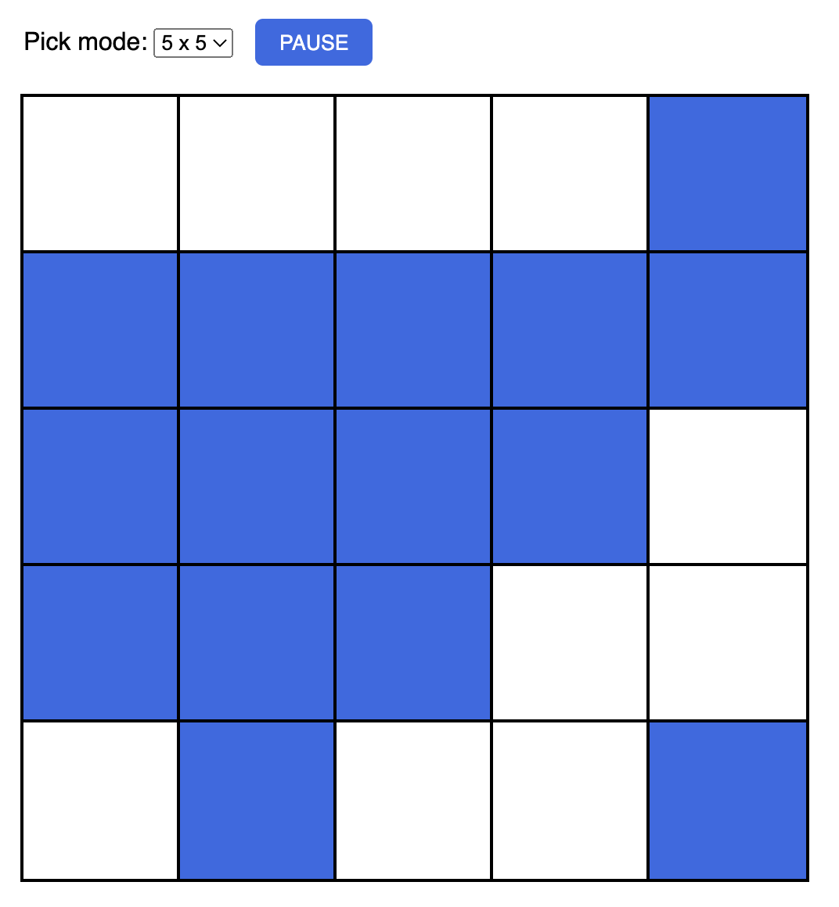

# HOVER GRID
*by Hilary Purrington*

## **Description**
In this application, grid squares toggle between white and blue when hovered over by the user's cursor. User may adjust the grid size from 2x2 up to 5x5.

View my page [here](https://hpurring.github.io/walnut/).

 

## **Installation**
Open in browser of choice.